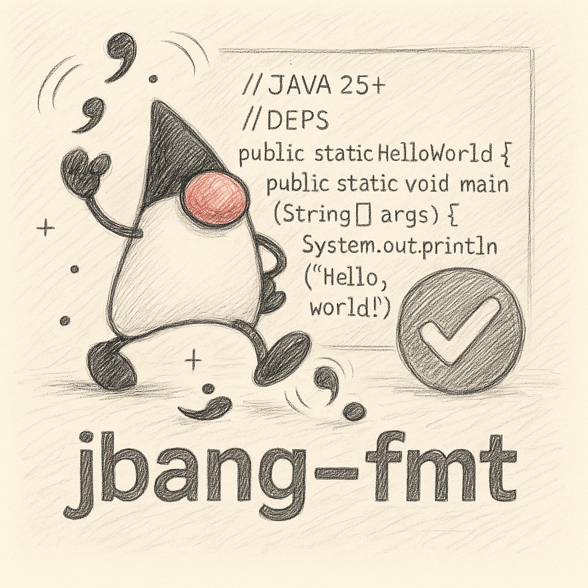

= JBang Java Formatter (`jbang-fmt`)

[NOTE]
====
**⚠️ Experimental:** +
This formatter is experimental and under active development. +
Please report issues or suggestions on https://github.com/jbangdev/jbang-fmt[GitHub].
====

This project provides a command-line tool for formatting Java source files, with special support for https://www.jbang.dev/[JBang] scripts and common Eclipse formatter styles.

== Why does this exist?

Most Java code formatters (including Eclipse, Google Java Format, etc.) do not handle JBang script files well. JBang scripts often start with special comment-based directives (like `//DEPS`, `//JAVA`, etc.) that are standard Java syntax, but standard formatters may reformat, move, or even delete these directives, breaking the script or making it unreadable.

This tool was created to solve that problem: it **formats Java code while leaving JBang directives untouched**. It is especially useful for developers who want to keep their JBang scripts clean and consistently formatted, without risking the loss or corruption of important script metadata.

== Features

* **Works 100% with Java while having JBang-friendly formatting:** By default, the tool detects and protects JBang directives, only formatting the actual true Java code and comments.
* **Check mode for CI/commit hooks:** Use `--check` to check if files would be formatted. Exit with 1 if any files would change.
* **Stdout output:** Use `--stdout` to print formatted content to stdout instead of modifying files.
* **Detailed statistics:** Shows processing time and file counts (processed, changed, clean, skipped).
* **Eclipse formatter support:** Uses the Eclipse Java code formatter under the hood, with the ability to load custom Eclipse `.xml` or `.prefs` style settings.
* **Easy override:** Override specific formatter settings, line length, Java version, indentation type, and indentation size.
* **Easy to use:** Simple CLI interface, works with files and directories, and can be run via https://www.jbang.dev/[JBang].
* **Customizable:** Supports toggling JBang-friendly mode and specifying custom formatter settings.

== Usage

You can install (and run) the tool using JBang:

[source,bash]
----
jbang app install jbang-fmt@jbangdev/jbang-fmt
----

=== Basic Examples

**Format a single Java file:**
[source,bash]
----
jbang-fmt MyFile.java
----

**Format all Java files in a directory:**
[source,bash]
----
jbang-fmt src/
----

**Format multiple files and directories:**
[source,bash]
----
jbang-fmt MyFile.java src/ tests/
----

**Using argument files (@ files):**

You can use `@` files to specify arguments from a file, which is useful for complex configurations or when you have many files to format:

[source,bash]
----
jbang-fmt @args.txt
----

Where `args.txt` contains:
[source,text]
----
--style google
--line-length 120
--java 17
src/main/java
src/test/java
----

This is particularly useful for:
* Complex formatting configurations
* CI/CD pipelines where you want to version control the formatting arguments
* Avoiding long command lines
* Sharing formatting configurations across team members

=== Check Mode and CI Integration

**Check if files would be formatted (perfect for CI):**
[source,bash]
----
jbang-fmt --check MyFile.java
----

**Check multiple files and directories:**
[source,bash]
----
jbang-fmt --check src/ tests/
----

The `--check` flag will:

* Show which files would be changed
* Display timing and file statistics
* Exit with code 1 if any files would change
* Exit with code 0 if no changes are needed

=== Output to Stdout

**Print formatted content to stdout instead of modifying files:**
[source,bash]
----
jbang-fmt --stdout MyFile.java
----

This is useful for:
* Piping formatted content to other tools
* Previewing changes before applying them
* Integration with other build tools

=== Using Different Formatter Styles

**Use Google Java Format style:**
[source,bash]
----
jbang-fmt --style google MyFile.java
----

The following predefined styles are available:

* `jbang` — JBang's project style (default)
* `eclipse` — Eclipse default Java formatter (Eclipse IDE style)
* `google` — Google Java Style Guide
* `java` — Java community style (OpenJDK-inspired)
* `quarkus` — Quarkus project style
* `spring` — Spring Framework style

**Use custom Eclipse settings file:**

If you want to be sure to have a specfifc style you should use the `--style` option with your version controlled Eclipse settings file.

[source,bash]
----
jbang-fmt --style /path/to/my-formatter.xml MyFile.java
----

You can also use JBang magic URL fetching for arguments.

[source,bash]
----
jbang jbang-fmt --style %{https://raw.githubusercontent.com/jbangdev/jbang-
fmt/refs/heads/main/src/quarkus.xml} --check .
----

=== Easy override

It is highly recommended to use the `--style` option to specify the formatter style you want to use for reproducible formatting.

But for those cases you might just want to do some one-off formatting without having to commit a new style file.

Below are options to tweak the formatter using property keys + some short hands for common settings (line length, java version, etc.).

**Override specific formatter settings:**
[source,bash]
----
jbang-fmt --setttings "brace_style=next_line,indentation_size=4" MyFile.java
----

or if you prefer to use compact key/value pairs.
Below `compact_else_if` is as if it was set to `true` because no value was specified.

[source,bash]
----
jbang-fmt -Stext_block_indentation=next_line -Scompact_else_if MyFile.java
----

The keys are the property keys from the Eclipse formatter settings file, you can find the full list in the https://github.com/jbangdev/jbang-fmt/tree/main/src/eclipse.xml[eclipse.xml] file.

For ease of use you can leave out the `org.eclipse.jdt.core.formatter.` prefix.

**Override line length:**
[source,bash]
----
jbang-fmt --line-length 120 MyFile.java
----

**Override Java version for formatting:**
[source,bash]
----
jbang-fmt --java 17 MyFile.java
----

**Override indentation type (spaces or tabs):**
[source,bash]
----
jbang-fmt --indent-with space MyFile.java
jbang-fmt --indent-with tab MyFile.java
----

**Override indentation size:**
[source,bash]
----
jbang-fmt --indent-size 4 MyFile.java
----

**Combine multiple options:**
[source,bash]
----
jbang-fmt --style google --line-length 100 --java 21 --indent-with space --indent-size 2 MyFile.java
----

=== Touch Directives

If you want to have JBang directives formatted as all other java code then run with `--touch-jbang`.
With this option `jbang-fmt` should work exactly as any other Eclipse formatter.

Below example shows how to use `--touch-jbang` with the `google` style which by default formats Java header comments which will break the JBang directives. The main reason why `jbang-fmt` exists is to avoid this.

[source,bash]
----
jbang-fmt --touch-directives --style google MyFile.java
----

=== Output Format

The tool provides detailed feedback about the formatting process:

**Normal mode output:**
[source,text]
----
Formatting with default[0 properties, jbang-friendly=false]...
MyFile.java
Formatted 3 files (1 changed, 2 clean, 0 skipped) in 0.2s
----

**Check mode output:**
[source,text]
----
Formatting with default[0 properties, touchJBang=false]...
MyFile.java
Would reformat 1 files (out of 3) in 0.2s. Run without --check to apply.
----

The statistics show:

* **Total files processed:** All Java files that were examined
* **Changed:** Files that were modified by the formatter
* **Clean:** Files that were already properly formatted
* **Skipped:** Non-Java files that were ignored
* **Processing time:** How long the formatting took

== Usecases

=== Git Integration

**Format only changed Java files in a git commit hook:**

Create a pre-commit hook (`.git/hooks/pre-commit`):
[source,bash]
----
#!/bin/bash

# Get list of staged Java files
STAGED_JAVA_FILES=$(git diff --cached --name-only --diff-filter=ACMR | grep '\.java$')

if [ -n "$STAGED_JAVA_FILES" ]; then
    echo "Formatting staged Java files..."
    
    # Format the staged files
    jbang-fmt --style jbang $STAGED_JAVA_FILES
    
    # Re-stage the formatted files
    git add $STAGED_JAVA_FILES
    
    echo "Java files formatted and re-staged."
fi
----

**Check-only hook to prevent commits with unformatted code:**

Create a pre-commit hook (`.git/hooks/pre-commit`):
[source,bash]
----
#!/bin/bash

# Get list of staged Java files
STAGED_JAVA_FILES=$(git diff --cached --name-only --diff-filter=ACMR | grep '\.java$')

if [ -n "$STAGED_JAVA_FILES" ]; then
    echo "Checking Java file formatting..."
    
    # Check if files need formatting
    if ! jbang-fmt --style jbang --check $STAGED_JAVA_FILES; then
        echo "❌ Some Java files are not properly formatted!"
        echo "Run 'jbang-fmt $STAGED_JAVA_FILES' to fix them."
        exit 1
    fi
    
    echo "✅ All Java files are properly formatted."
fi
----

**Make the hook executable:**
[source,bash]
----
chmod +x .git/hooks/pre-commit
----

=== Maven Integration

Use the jbang-maven-plugin to format Java files in your Maven project:

**Add the plugin to your `pom.xml`:**
[source,xml]
----
<plugin>
    <groupId>dev.jbang</groupId>
    <artifactId>jbang-maven-plugin</artifactId>
    <version>0.4.0</version>
    <executions>
        <execution>
            <id>format</id>
            <goals>
                <goal>run</goal>
            </goals>
            <configuration>
                
                <args>
                    <arg>--style</arg>
                    <arg>jbang</arg>
                    <arg>src/main/java</arg>
                    <arg>src/test/java</arg>
                </args>
            </configuration>
        </execution>
    </executions>
</plugin>
----

**Run formatting:**
[source,bash]
----
mvn jbang:run@format
----

**Check formatting (for CI):**
[source,xml]
----
<plugin>
    <groupId>dev.jbang</groupId>
    <artifactId>jbang-maven-plugin</artifactId>
    <version>0.4.0</version>
    <executions>
        <execution>
            <id>check-format</id>
            <goals>
                <goal>run</goal>
            </goals>
            <configuration>
                
                <args>
                    <arg>--style</arg>
                    <arg>jbang</arg>
                    <arg>--check</arg>
                    <arg>src/main/java</arg>
                    <arg>src/test/java</arg>
                </args>
            </configuration>
        </execution>
    </executions>
</plugin>
----

**Run format check:**
[source,bash]
----
mvn jbang:run@check-format
----

**Integration with Maven build lifecycle (format before compile):**
[source,xml]
----
<plugin>
    <groupId>dev.jbang</groupId>
    <artifactId>jbang-maven-plugin</artifactId>
    <version>0.4.0</version>
    <executions>
        <execution>
            <id>format-before-compile</id>
            <phase>generate-sources</phase>
            <goals>
                <goal>run</goal>
            </goals>
            <configuration>
                
                <args>
                    <arg>--style</arg>
                    <arg>jbang</arg>
                    <arg>src/main/java</arg>
                    <arg>src/test/java</arg>
                </args>
            </configuration>
        </execution>
    </executions>
</plugin>
----

This will automatically format your Java files during the `generate-sources` phase, which runs before compilation. The formatting happens automatically when you run:

[source,bash]
----
mvn compile
----

**Alternative: Format check before compile (fail build if unformatted):**
[source,xml]
----
<plugin>
    <groupId>dev.jbang</groupId>
    <artifactId>jbang-maven-plugin</artifactId>
    <version>0.4.0</version>
    <executions>
        <execution>
            <id>check-format-before-compile</id>
            <phase>generate-sources</phase>
            <goals>
                <goal>run</goal>
            </goals>
            <configuration>
                
                <args>
                    <arg>--style</arg>
                    <arg>jbang</arg>
                    <arg>--check</arg>
                    <arg>src/main/java</arg>
                    <arg>src/test/java</arg>
                </args>
            </configuration>
        </execution>
    </executions>
</plugin>
----

This will check formatting during the `generate-sources` phase and fail the build if any files need formatting.

=== Gradle Integration

Use the jbang-gradle-plugin to format Java files in your Gradle project:

**Add the plugin to your `build.gradle`:**
[source,gradle]
----
plugins {
    id 'dev.jbang.gradle' version '0.4.0'
}

jbang {
    script 'jbang-fmt@jbangdev/jbang-fmt'
    args '--style', 'jbang', 'src/main/java', 'src/test/java'
}
----

**Run formatting:**
[source,bash]
----
./gradlew jbang
----

**For format checking, create a separate task:**
[source,gradle]
----
plugins {
    id 'dev.jbang.gradle' version '0.4.0'
}

task checkFormat(type: dev.jbang.gradle.JbangTask) {
    script 'jbang-fmt@jbangdev/jbang-fmt'
    args '--style', 'jbang', '--check', 'src/main/java', 'src/test/java'
}

task format(type: dev.jbang.gradle.JbangTask) {
    script 'jbang-fmt@jbangdev/jbang-fmt'
    args '--style', 'jbang', 'src/main/java', 'src/test/java'
}
----

**Run tasks:**
[source,bash]
----
./gradlew format        # Format files
./gradlew checkFormat   # Check formatting
----

**Integration with build lifecycle:**
[source,gradle]
----
plugins {
    id 'dev.jbang.gradle' version '0.4.0'
}

task checkFormat(type: dev.jbang.gradle.JbangTask) {
    script 'jbang-fmt@jbangdev/jbang-fmt'
    args '--style', 'jbang', '--check', 'src/main/java', 'src/test/java'
}

// Run format check before compilation
compileJava.dependsOn checkFormat
----

## TODO

Probably should make this a published jar on maven central and/or github release, jrelease etc....but for now
just use it via JBang :)